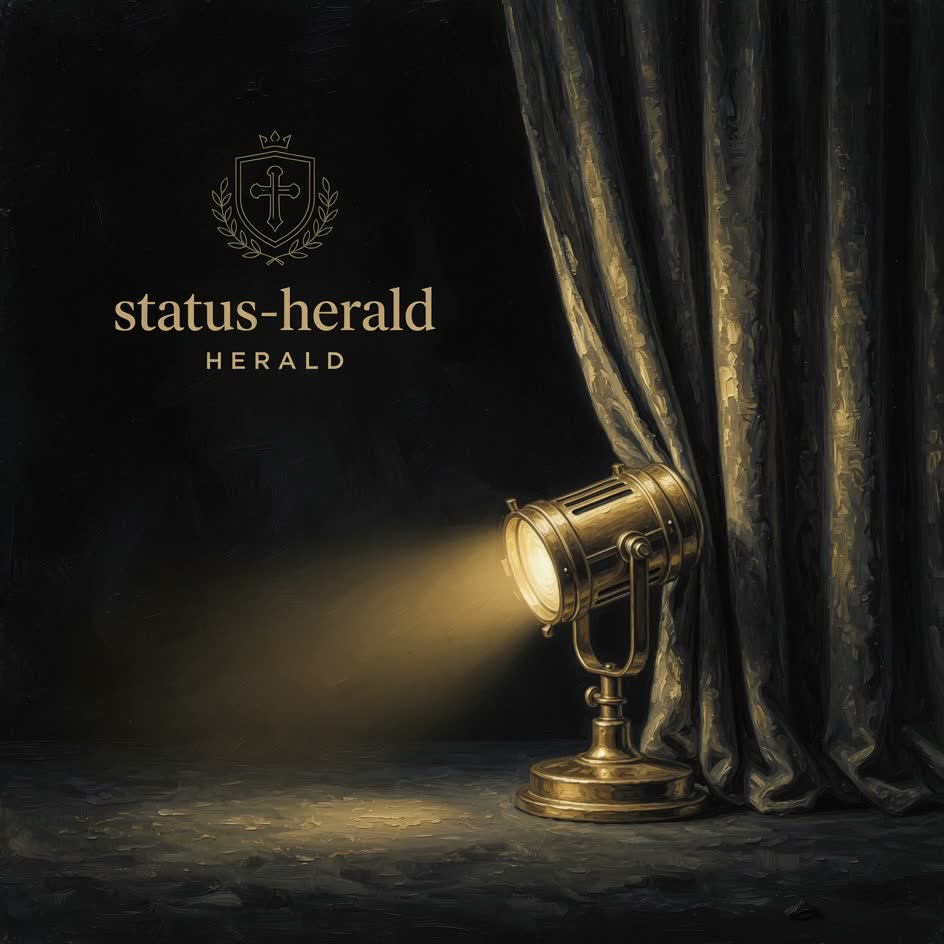

<p align="center">
  
</p>

<p align="center">
  <a href="https://herald.muslewski.com"></a>
  <a href="https://github.com/muslewski/status-herald"></a>
</p>

# status-herald — marketing website

Public one-pager for **[status-herald](https://github.com/muslewski/status-herald)** — tmux curtain cards for agent fleets.

**Live → [herald.muslewski.com](https://herald.muslewski.com)**

> **Looking for the tool?** `herald curtain install` and the CLI live here:  
> **https://github.com/muslewski/status-herald**

## Brand

Stage black · red proscenium curtains · gold fringe · **WORKING / DONE / NEEDS YOU** · card on film.

| Asset | Role |
|-------|------|
| `public/video/v01.mp4` | Spotlight plate (seamless loop) |
| `public/posters/v01.jpg` | Still / OG-friendly frame |
| `public/video/v06.mp4` | Fleet stage supporting reel |

## Develop

```bash
npm install && npm run dev
npm run build
```

## Deploy

Vercel · **herald.muslewski.com**

## License

MIT-family marketing site. Brand art © Mateusz Muslewski.

## Community

Product support lives on **[status-herald](https://github.com/muslewski/status-herald)**:

- [Discussions](https://github.com/muslewski/status-herald/discussions) — questions & ideas
- [Issues](https://github.com/muslewski/status-herald/issues) — bugs & features
- Website-only fixes — open an issue here
